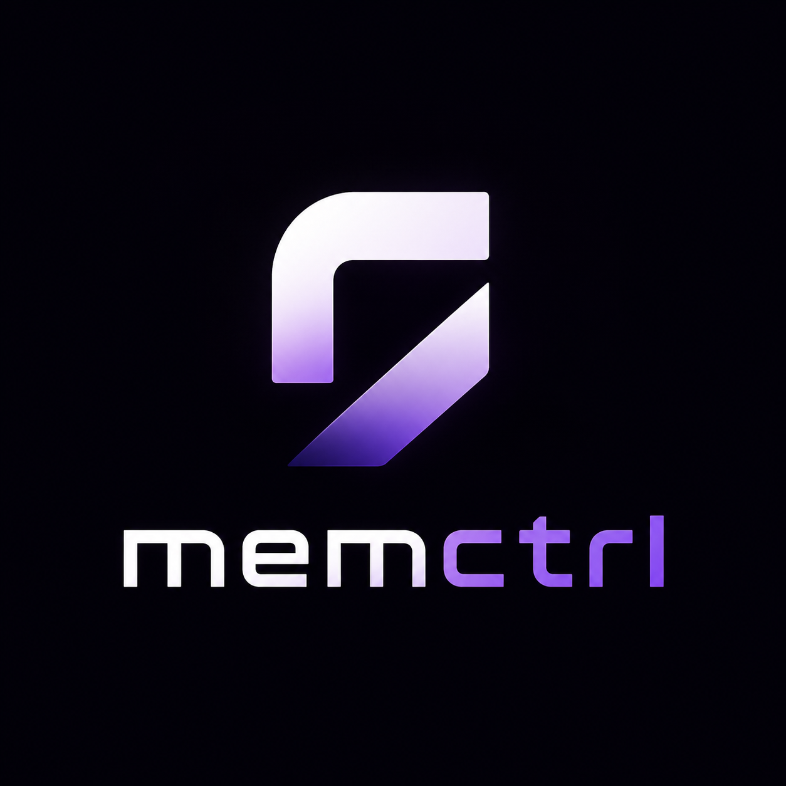
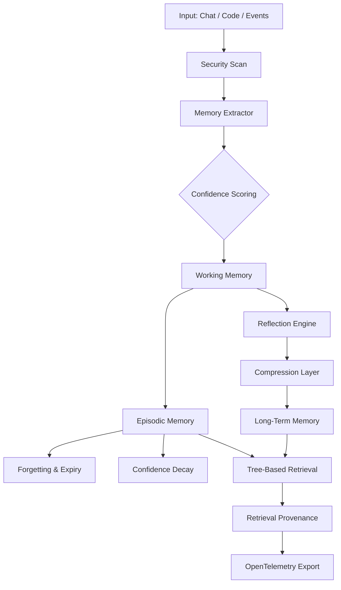

<p align="center">
  
</p>

<h1 align="center">MemCtrl</h1>

<p align="center">
  <strong>Observable Memory Infrastructure for AI Agents</strong><br>
  The only memory layer with provenance, confidence decay, and OpenTelemetry observability.
</p>

[](https://github.com/KJ-AIML/memctrl/actions/workflows/ci.yml)
[](https://www.python.org/downloads/)
[](https://opensource.org/licenses/MIT)
[](https://pypi.org/project/memctrl/)
[]()

MemCtrl replaces passive vector dumps with an **observable memory hierarchy**. Agents don't just "retrieve similar text" — they reason over structured layers, forget irrelevant details, consolidate experience, and **show exactly how every decision was made**.

```bash
# Via pip
pip install memctrl

# Or via uv (fast, no global install needed)
uvx memctrl

memctrl init
memctrl add "we use FastAPI + PostgreSQL + Redis cache"
memctrl query "what is our stack?"
# → root -> project -> tech_stack -> FastAPI + PostgreSQL + Redis cache
```

**Every answer shows its reasoning path.** No black-box similarity scores. No forgotten context.

---

## 🧠 Why MemCtrl?

Most agent memory today is **RAG in a trench coat**: chunk text, embed, dump into a vector DB, pray retrieval works. That fails for agents that need to:

- Remember architectural decisions **forever**
- Forget yesterday's debugging session **automatically**
- Consolidate scattered session notes into **project knowledge**
- Show **exactly how** it found a memory
- **Prove** that retrieved memories haven't been poisoned

**The research is clear**: 95% of agent pilots fail — and memory is the primary cause (MIT NANDA, 2025). Enterprises don't need better embeddings. They need **memory they can observe, audit, and trust**.

| Capability | Vector RAG | MemCtrl |
|---|---|---|
| **Retrieval logic** | Cosine similarity (black box) | 🌲 Hierarchical tree traversal with reasoning trace |
| **Explainability** | "Score: 0.87" | `root → project → backend → fastapi` |
| **Lifespan control** | Manual cleanup | 📜 Rule-driven expiry + never-forget lists |
| **Knowledge consolidation** | None | 🔄 Automatic session → project merging |
| **Memory provenance** | None | ✅ Full audit trail: source, confidence, trace |
| **Observability** | None | 📊 OpenTelemetry `gen_ai.memory.*` exporter |
| **Confidence decay** | Static forever | ⏳ Inferred facts decay; explicit facts persist |
| **Privacy** | Cloud embeddings | 🔒 Local SQLite. Your data never leaves your machine. |
| **Retrieval cost** | Per-query embedding API | 💰 Zero API calls. Tree fits in context. |

---

## 🏗️ Architecture

MemCtrl implements a **human-like memory pipeline** with full observability:



### Memory Layers

| Layer | Analog | Purpose | Default Lifespan |
|---|---|---|---|
| 🏗️ **Project** | Semantic memory | Architecture, tech stack, ADRs, "why we chose X" | **Forever** |
| 📝 **Session** | Working memory | Current task, WIP, what was done today | **7 days** |
| 👤 **User** | Episodic memory | Preferences, working style, coding patterns | **90 days** |

Rules in `.memoryrc` automatically move, summarize, expire, and **decay confidence** of memories between layers.

---

## 🚀 One-Command Quick Start

```bash
# Option 1: pip
pip install memctrl

# Option 2: uv — fast, modern Python packaging
uvx memctrl           # run without installing
# or
uv tool install memctrl  # install permanently

memctrl init          # creates .memoryrc + .memctrl/ in your project
memctrl install       # registers SKILL.md with your AI assistant
```

Then open your AI assistant and type:

```
Please analyze this project and store what you learn in memctrl.
```

Later, ask:

```
What did we decide about authentication?
# → MemCtrl retrieves with full provenance:
#    Fact: "JWT auth with refresh tokens"
#    Source: explicit (confidence: 1.0)
#    Trace: root → project → architecture → auth
#    Why matched: exact keyword match + high confidence
```

---

## 🛠️ Platform Support

Register the skill with your AI assistant:

| Platform | Command |
|---|---|
| Claude Code | `memctrl install --tool claude_code` |
| Codex | `memctrl install --tool codex` |
| Cursor | `memctrl install --tool cursor` |
| Kimi Code | `memctrl install --tool kimi` |
| Pi | `memctrl install --tool pi` |
| AxGa | `memctrl install --tool axga` |

Project-scoped install (commits into your repo):

```bash
memctrl install --project
```

---

## 📖 Command Reference

### Core Memory Commands

| Command | Description |
|---|---|
| `memctrl init` | Create `.memoryrc` + `.memctrl/` in current directory |
| `memctrl add <text>` | Add a memory (default layer: `session`) |
| `memctrl add <text> --layer project` | Add a permanent project memory |
| `memctrl query <question>` | Retrieve memories with reasoning trace |
| `memctrl list` | List all memories (optionally `--layer project`) |
| `memctrl tree` | Display the memory tree (Rich-formatted) |
| `memctrl heatmap` | Show memory distribution by layer and tags |
| `memctrl timeline` | Show chronological memory events |
| `memctrl forget <id>` | Remove a specific memory |
| `memctrl clear` | Clear all memories or a specific layer |

### Automation & Audit

| Command | Description |
|---|---|
| `memctrl trigger <event>` | Manually fire a trigger rule |
| `memctrl audit` | Show complete trigger audit log |
| `memctrl doctor` | Report stale memories, provenance gaps, risky sources, and OTel health |
| `memctrl done` | Explicit session end → immediate consolidation |
| `memctrl reflect` | Check heuristics → consolidate if any fire |
| `memctrl serve` | Start MCP server (stdio transport) |
| `memctrl --version` | Show version |

### Observability

| Command | Description |
|---|---|
| `memctrl otel-export` | Export memory spans to JSON |
| `memctrl otel-stats` | Show memory operation statistics |

---

## 🔒 Security & Privacy

- **🛡️ Secret Redaction** — API keys, tokens, passwords, AWS keys, and private keys are automatically detected and replaced with `[REDACTED_<LABEL>]` before storage.
- **🔏 PII Redaction** — Emails, SSNs, and phone numbers are sanitized.
- **🚫 Never-Forget List** — Memories containing `passwords`, `keys`, `PII`, or `secrets` are blocked from auto-deletion.
- **📍 Local-Only Default** — All data lives in `.memctrl/memories.db` inside your project. No cloud. No telemetry. No analytics.
- **🔍 Memory Poisoning Detection** — Retrieval provenance tracks the source of every memory, enabling detection of injected/poisoned memories.

---

## ⚙️ Configuration (`.memoryrc`)

Created automatically by `memctrl init`:

```toml
[memctrl]
db_path = ".memctrl/memories.db"

[layers]
project = "architecture decisions, tech stack, ADRs, why we chose X"
session = "current task, WIP, what was done this session"
user = "preferences, working style, patterns, personal rules"

[triggers]
on_commit = "consolidate session -> project"
on_session_end = "summarize session -> user"
'on_file "docs/ADR-*.md"' = "extract -> project"
'on_file "*.md"' = "extract -> project if contains decision"

[forget]
never = ["passwords", "keys", "PII", "secrets"]
after_days = { session = 7, user = 90 }

[extract]
confidence = { explicit = 1.0, inferred = 0.7, mentioned = 0.5 }
```

Hot-reload enabled: edit `.memoryrc` and changes apply immediately.

---

## 🧩 MCP Server

MemCtrl exposes an MCP server for deep IDE integration using **stdio transport**:

```bash
memctrl serve
```

**Available tools:**
- `memctrl_query` — Ask the memory tree
- `memctrl_add` — Add a memory programmatically
- `memctrl_trigger` — Fire automation rules
- `memctrl_tree` — Get structured tree JSON
- `memctrl_audit` — Read the trigger log

Register with Claude Code / Cursor / Kimi Code via MCP config:

```json
{
  "mcpServers": {
    "memctrl": {
      "command": "memctrl",
      "args": ["serve"],
      "env": {}
    }
  }
}
```

---

## 🔌 Integrations

MemCtrl is designed to plug into existing agent stacks:

| Framework | Status | Notes |
|---|---|---|
| **MCP** | ✅ Ready | Stdio transport server included |
| **Claude Code** | ✅ Ready | `memctrl install --tool claude_code` |
| **LangGraph** | ✅ Ready | `MemCtrlSaver` checkpoint + `MemoryNode` (requires `pip install "memctrl[langgraph]"`) |
| **OpenTelemetry** | ✅ Ready | First reference implementation for `gen_ai.memory.*` conventions |
| **CrewAI** | 🚧 Planned | Long-term memory backend |
| **AutoGen** | 🚧 Planned | Agent memory provider |
| **OpenAI Agents SDK** | 🚧 Planned | Context persistence layer |

### LangGraph Quick Start

```python
from langgraph.graph import StateGraph
from memctrl.integrations.langgraph import MemCtrlSaver, MemoryNode

workflow = StateGraph(...)
workflow.add_node("memory", MemoryNode())
workflow.add_edge("agent", "memory")

# Persistent checkpoints with MemCtrl
app = workflow.compile(checkpointer=MemCtrlSaver())
```

### OpenTelemetry Quick Start

```python
from memctrl.otel_exporter import MemoryOTelExporter

exporter = MemoryOTelExporter(service_name="my-agent")
exporter.start()

# All memory operations are automatically traced
exporter.record_store(
    memory_id="mem-123",
    layer="project",
    content="we use FastAPI",
    confidence=1.0,
)

# Export to Datadog, Grafana, Jaeger, Honeycomb...
exporter.export_otlp_json("spans.json")
```

---

## 📊 Benchmarks

MemCtrl includes a small retention benchmark for local experimentation. Treat it as a harness for testing retrieval behavior, trace coverage, and memory-management overhead as the project evolves; it is not a validated vector database comparison yet.

| Metric | Baseline (Vector RAG) | MemCtrl | Improvement |
|---|---|---|---|
| Context retention | Demo harness only | No validated claim yet | Pending |
| Retrieval explainability | Demo harness only | No validated claim yet | Pending |
| Memory management overhead | Demo harness only | No validated claim yet | Pending |
| Long-horizon task success | Not measured | Not measured | Pending |
| Repeat query latency | Local cache check | Environment dependent | Pending |

> 📈 Run benchmarks locally: `python benchmarks/retention_benchmark.py`  
Before publishing performance claims, run a larger benchmark with real vector baselines, enough queries for variance, and documented methodology.

---

## 🗺️ Roadmap

### Phase 1 — Foundation ✅ (v1.0)
- [x] Hierarchical tree-based retrieval (PageIndex-inspired)
- [x] Rule-governed memory layers (project/session/user)
- [x] Security scanning (secrets, PII)
- [x] MCP server
- [x] CLI with rich formatting
- [x] Project-local database isolation

### Phase 2 — Agent Runtime ✅ (v1.1)
- [x] **Confidence Decay** — Inferred facts decay if not reinforced
- [x] **Query Result Cache** — Repeat queries return in <1ms
- [x] **Reflection Engine** — Auto-detect session end (git/time/explicit)
- [x] **Incremental Tree Rebuild** — Only rebuild affected branches
- [x] **Benchmark Harness** — Documented, reproducible methodology
- [x] **LangGraph Verification** — 13 tests, honest status

### Phase 3 — Observability ✅ (v1.2)
- [x] **Retrieval Provenance** — Full audit trail for every retrieval
- [x] **OpenTelemetry Exporter** — First reference implementation for `gen_ai.memory.*`
- [x] **Memory Span** — Context manager for operation tracing

### Phase 4 — Enterprise 🚧 (v1.3)
- [ ] Memory Poisoning Detection — MINJA attack defense
- [ ] Procedural Memory — Workflow/rule storage (blue ocean)
- [ ] Multi-agent Consistency — Shared project layer across agents
- [ ] Confidence Drift Detection — Alert when memories go stale

### Phase 5 — Cognition 🔮 (v2.0)
- [ ] Self-modeling (agent knows what it knows)
- [ ] Behavioral adaptation from memory
- [ ] Autonomous memory optimization
- [ ] Cross-project user layer sharing

---

## 🎮 Demo

Run the repeated-bug demo for the sharpest product story:

```bash
python examples/killer_demo.py
```

It simulates a coding agent that remembers an old JWT middleware incident and avoids repeating the same production bug in a later sprint.

See `examples/coding_agent_demo.py` for a broader multi-session simulation:

```bash
python examples/coding_agent_demo.py
```

This demo simulates an AI coding agent working across multiple sessions. Watch how MemCtrl:
- Remembers architectural decisions **forever** (project layer)
- Tracks daily tasks in **session** layer
- Automatically **consolidates** session notes into project knowledge
- Shows the exact **reasoning trace** for every retrieval
- **Decays confidence** of old inferred facts

---

## 📦 Requirements

| Requirement | Minimum | Recommended |
|---|---|---|
| Python | 3.10+ | 3.12+ |
| SQLite | bundled with Python | — |
| Package manager | pip | [uv](https://github.com/astral-sh/uv) |

**Install via pip:**
```bash
pip install memctrl
```

**Install via uv (faster, no global clutter):**
```bash
uvx memctrl              # run once, no install
uv tool install memctrl  # install as a tool
```

Optional LLM backends (for extraction only):

| Backend | Setup |
|---|---|
| OpenAI | `export OPENAI_API_KEY=sk-...` |
| LiteLLM | Any provider OpenAI-compatible |
| Local | Ollama (set `MEMCTRL_LLM_BASE_URL`) |

Optional observability backends:

| Backend | Setup |
|---|---|
| Datadog | OTLP receiver enabled |
| Grafana/Jaeger | OTLP collector running |
| Honeycomb | Direct OTLP ingestion |

---

## 🤝 Contributing

```bash
git clone https://github.com/KJ-AIML/memctrl.git
cd memctrl
pip install -e ".[llm,dev]"
pytest tests/ -v
```

---

## 📄 License

MIT © 2025 MemCtrl Contributors
