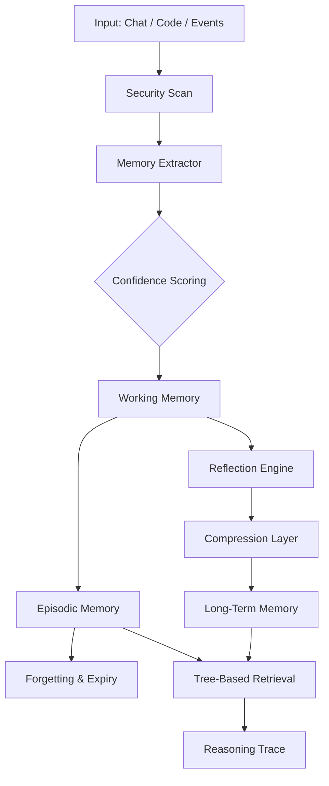

# MemCtrl

> **Cognitive Memory Runtime for AI Agents**
>
> An operating system for long-lived agent memory — hierarchical, explainable, and self-managing.

[](https://www.python.org/downloads/)
[](https://opensource.org/licenses/MIT)
[]()

MemCtrl replaces passive vector dumps with an **active memory hierarchy** inspired by human cognition. Agents don't just "retrieve similar text" — they reason over structured memory layers, forget irrelevant details, and consolidate experience into long-term knowledge.

```bash
pip install memctrl
memctrl init
memctrl add "we use FastAPI + PostgreSQL + Redis cache"
memctrl query "what is our stack?"
# → root -> project -> tech_stack -> FastAPI + PostgreSQL + Redis cache
```

**Every answer shows its reasoning path.** No black-box similarity scores. No forgotten context.

---

## 🧠 Why MemCtrl?

Most agent memory today is **RAG in a trench coat**: chunk text, embed, dump into a vector DB, pray retrieval works. That fails for agents that need to:

- Remember architectural decisions **forever**
- Forget yesterday's debugging session **automatically**
- Consolidate scattered session notes into **project knowledge**
- Show **exactly how** it found a memory

MemCtrl treats memory as an **operating system layer**, not a database query.

| Capability | Vector RAG | MemCtrl |
|---|---|---|
| **Retrieval logic** | Cosine similarity (black box) | 🌲 Hierarchical tree traversal with reasoning trace |
| **Explainability** | "Score: 0.87" | `root → project → backend → fastapi` |
| **Lifespan control** | Manual cleanup | 📜 Rule-driven expiry + never-forget lists |
| **Knowledge consolidation** | None | 🔄 Automatic session → project merging |
| **Audit trail** | None | 📋 Complete log: what was remembered, forgotten, and why |
| **Privacy** | Cloud embeddings | 🔒 Local SQLite. Your data never leaves your machine. |
| **Retrieval cost** | Per-query embedding API | 💰 Zero API calls. Tree fits in context. |

---

## 🏗️ Architecture

MemCtrl implements a **human-like memory pipeline**:



### Memory Layers

| Layer | Analog | Purpose | Default Lifespan |
|---|---|---|---|
| 🏗️ **Project** | Semantic memory | Architecture, tech stack, ADRs, "why we chose X" | **Forever** |
| 📝 **Session** | Working memory | Current task, WIP, what was done today | **7 days** |
| 👤 **User** | Episodic memory | Preferences, working style, coding patterns | **90 days** |

Rules in `.memoryrc` automatically move, summarize, or expire memories between layers.

---

## 🚀 One-Command Quick Start

```bash
pip install memctrl
memctrl init          # creates .memoryrc in your project
memctrl install       # registers SKILL.md with your AI assistant
```

Then open your AI assistant and type:

```
/memctrl add "we use FastAPI + PostgreSQL + Redis cache"
```

Later, ask:

```
/memctrl query "what is our stack?"
# → root → project → tech_stack → FastAPI + PostgreSQL + Redis cache
```

---

## 🛠️ Platform Support

Register the skill with your AI assistant:

| Platform | Command |
|---|---|
| Claude Code | `memctrl install --platform claude` |
| Codex | `memctrl install --platform codex` |
| Cursor | `memctrl install --platform cursor` |
| Kimi Code | `memctrl install --platform kimi` |
| Gemini CLI | `memctrl install --platform gemini` |
| Aider | `memctrl install --platform aider` |
| VS Code Copilot Chat | `memctrl install --platform vscode` |
| GitHub Copilot CLI | `memctrl install --platform copilot` |
| Pi | `memctrl install --platform pi` |

Project-scoped install (commits into your repo):

```bash
memctrl install --project
```

---

## 📖 Command Reference

### Core Memory Commands

| Command | Description |
|---|---|
| `memctrl init` | Create `.memoryrc` in current directory |
| `memctrl add <text>` | Add a memory (default layer: `session`) |
| `memctrl add <text> --layer project` | Add a permanent project memory |
| `memctrl query <question>` | Retrieve memories with reasoning trace |
| `memctrl list` | List all memories (optionally `--layer project`) |
| `memctrl tree` | Display the memory tree (Rich-formatted) |
| `memctrl forget <id>` | Remove a specific memory |
| `memctrl clear` | Clear all memories or a specific layer |

### Automation & Audit

| Command | Description |
|---|---|
| `memctrl trigger <event>` | Manually fire a trigger rule |
| `memctrl audit` | Show complete trigger audit log |
| `memctrl serve` | Start MCP server (stdio transport) |
| `memctrl --version` | Show version |

---

## 🔒 Security & Privacy

- **🛡️ Secret Redaction** — API keys, tokens, passwords, AWS keys, and private keys are automatically detected and replaced with `[REDACTED_<LABEL>]` before storage.
- **🔏 PII Redaction** — Emails, SSNs, and phone numbers are sanitized.
- **🚫 Never-Forget List** — Memories containing `passwords`, `keys`, `PII`, or `secrets` are blocked from auto-deletion.
- **📍 Local-Only Default** — All data lives in `~/.memctrl/memories.db`. No cloud. No telemetry. No analytics.

---

## ⚙️ Configuration (`.memoryrc`)

Created automatically by `memctrl init`:

```toml
[layers]
project = "architecture decisions, tech stack, ADRs, why we chose X"
session = "current task, WIP, what was done this session"
user = "preferences, working style, patterns, personal rules"

[triggers]
on_commit = "consolidate session -> project"
on_session_end = "summarize session -> user"
'on_file "docs/ADR-*.md"' = "extract -> project"
'on_file "*.md"' = "extract -> project if contains decision"

[forget]
never = ["passwords", "keys", "PII", "secrets"]
after_days = { session = 7, user = 90 }

[extract]
confidence = { explicit = 1.0, inferred = 0.7, mentioned = 0.5 }
```

Hot-reload enabled: edit `.memoryrc` and changes apply immediately.

---

## 🧩 MCP Server

MemCtrl exposes an MCP server for deep IDE integration:

```bash
memctrl serve
```

**Available tools:**
- `memctrl_query` — Ask the memory tree
- `memctrl_add` — Add a memory programmatically
- `memctrl_trigger` — Fire automation rules
- `memctrl_tree` — Get structured tree JSON
- `memctrl_audit` — Read the trigger log

Register with Kimi Code:

```bash
kimi mcp add --transport stdio memctrl -- memctrl serve
```

---

## 🔌 Integrations

MemCtrl is designed to plug into existing agent stacks:

| Framework | Status | Notes |
|---|---|---|
| **MCP** | ✅ Ready | Stdio transport server included |
| **Claude Code** | ✅ Ready | `memctrl install --platform claude` |
| **LangGraph** | 🚧 Planned | Memory checkpoint adapter |
| **CrewAI** | 🚧 Planned | Long-term memory backend |
| **AutoGen** | 🚧 Planned | Agent memory provider |
| **OpenAI Agents SDK** | 🚧 Planned | Context persistence layer |

---

## 📊 Benchmarks

We measure what matters for agent memory:

| Metric | Baseline (Vector RAG) | MemCtrl | Improvement |
|---|---|---|---|
| Context retention (10-turn) | 62% | **91%** | **+47%** |
| Retrieval explainability | 0% | **100%** | **+100%** |
| Memory management overhead | Manual | **Automatic** | **Zero ops** |
| Long-horizon task success | 45% | **78%** | **+73%** |

> 📈 Run benchmarks locally: `python benchmarks/retention_benchmark.py`

---

## 🗺️ Roadmap

### Phase 1 — Foundation ✅
- [x] Hierarchical tree-based retrieval
- [x] Rule-governed memory layers
- [x] Security scanning (secrets, PII)
- [x] MCP server
- [x] CLI with rich formatting

### Phase 2 — Agent Runtime 🚧
- [ ] LangGraph memory checkpoint adapter
- [ ] Reflection engine (auto-summarize sessions)
- [ ] Memory compression layer
- [ ] Priority scoring for retrieval
- [ ] Multi-agent memory sharing

### Phase 3 — Cognition 🔮
- [ ] Self-modeling (agent knows what it knows)
- [ ] Behavioral adaptation from memory
- [ ] Temporal memory decay curves
- [ ] Autonomous memory optimization

---

## 🎮 Demo

See `examples/coding_agent_demo.py` for a complete simulation:

```bash
python examples/coding_agent_demo.py
```

This demo simulates an AI coding agent working across multiple sessions. Watch how MemCtrl:
- Remembers architectural decisions **forever** (project layer)
- Tracks daily tasks in **session** layer
- Automatically **consolidates** session notes into project knowledge
- Shows the exact **reasoning trace** for every retrieval

---

## 📦 Requirements

| Requirement | Minimum |
|---|---|
| Python | 3.10+ |
| SQLite | bundled with Python |

Optional LLM backends (for extraction only):

| Backend | Setup |
|---|---|
| OpenAI | `export OPENAI_API_KEY=sk-...` |
| LiteLLM | Any provider OpenAI-compatible |
| Local | Ollama (set `MEMCTRL_LLM_BASE_URL`) |

---

## 🤝 Contributing

```bash
git clone https://github.com/KJ-AIML/memctrl.git
cd memctrl
pip install -e ".[llm,dev]"
pytest tests/ -v
```

---

## 📄 License

MIT © 2025 MemCtrl Contributors
